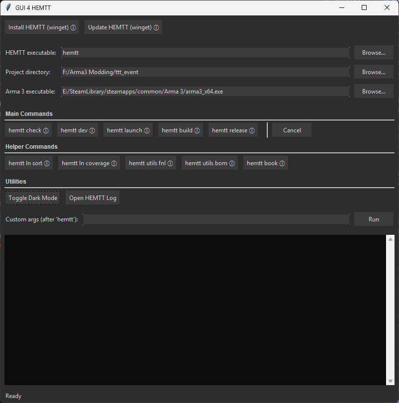

# GUI 4 HEMTT

A lightweight cross-platform (Windows-focused) Tkinter GUI wrapper for the `hemtt` CLI tool.

## Screenshot

Below is an example of the GUI in use (dark mode with build options visible).



## Features

- One-click core commands: `hemtt build`, `hemtt dev`, `hemtt check`, `hemtt release`, `hemtt launch`.
- Winget convenience: `Install HEMTT (winget)` and `Update HEMTT (winget)` buttons (Windows) to install or upgrade the `BrettMayson.HEMTT` package.
- Extended commands: `hemtt ln sort`, `hemtt ln coverage`, `hemtt license`, `hemtt script <name>`, `hemtt utils fnl`, `hemtt new <project>`.
- Launch dialog with profiles, instances, executable override, optionals, quick mode, passthrough arguments (`--`), binarize options.
- Build/Dev option toggles: `--binarize`, `--no-rap`, `--all-optionals` (`-O`), `--optional <addon>` (comma list), `--just <addon>`, threads (`-t`).
- Dark / Light mode toggle with styled controls.
- Drag & Drop a folder anywhere in the window to set the project directory (optional dependency).
- Persistent paths: HEMTT executable, project directory, Arma 3 executable stored in `config.json`.
- Export log to timestamped text file.
- Color-coded console output with basic severity detection (error / warning / info).
- Elapsed time and status bar with live update.
- New project dialog (wrapper for `hemtt new`).
- License dialog (choose common licenses or interactive mode).
- Script dialog for quick execution.
- Cancellation of running process.
- Custom argument entry (after `hemtt`).

## Requirements

- Python 3.11+ (3.9+ may work; not tested).
- `hemtt` installed and available in PATH, or set via browse.
- Tkinter (ships with CPython).

### Optional (for Drag & Drop)

To enable drag-and-drop of a project folder:

```pwsh
pip install tkinterdnd2
```

If `tkinterdnd2` is not installed, the app functions normally without drag-and-drop.

## Running

```pwsh
python hemtt_gui.py
```

Use the Browse buttons to set your project directory and (optionally) the `hemtt` executable path.

### Installing / Updating HEMTT (Windows)

If you don't have HEMTT yet (or want to upgrade), use the top two buttons:

- `Install HEMTT (winget)` → runs: `winget install --id BrettMayson.HEMTT -e`
- `Update HEMTT (winget)` → runs: `winget upgrade --id BrettMayson.HEMTT -e`

You can do the same manually in a terminal:

```pwsh
winget search hemtt
winget install --id BrettMayson.HEMTT -e
winget upgrade --id BrettMayson.HEMTT -e
```

After installation, ensure `hemtt` resolves in PATH or browse directly to its executable.

## Custom Commands

Enter additional arguments exactly as you would after `hemtt` on the CLI. Example:

```text
validate
```

Then press Run.

You can also use multiple flags, e.g.

```text
dev --just core --just weapons -v -v
```

## Packaging (Windows executable)

Using PyInstaller to create a single-folder distribution:

```pwsh
pip install pyinstaller
pyinstaller --name HemttGUI --windowed --onefile hemtt_gui.py
```

This will produce `dist/HemttGUI.exe`. Distribute that file along with a README if desired.

If you need to embed an icon:

```pwsh
pyinstaller --name HemttGUI --windowed --onefile --icon=icon.ico hemtt_gui.py
```

## Code Structure

- `hemtt_gui.py` – Main Tkinter application.
- `command_runner.py` – Background process runner & output streaming.
- `config_store.py` – Simple JSON config persistence.
- `tests.py` – Basic helper tests.

## GitHub Actions: Build on Release

This repository includes a workflow at `.github/workflows/release.yml` that:

- Builds the Windows executable with PyInstaller
- Attaches the `HemttGUI.exe` artifact to the GitHub Release

Trigger it by publishing a new Release in GitHub (or run manually via the Actions tab). Ensure Actions are enabled and the default `GITHUB_TOKEN` has `contents: write` (the workflow sets this).

## Limitations / Future Improvements

- No progress bar (HEMTT doesn't emit structured progress; could parse lines heuristically).
- Potential future: favorites list, output filtering (errors only), command history dropdown.
- Could add auto-switch to new project directory after `hemtt new` completes.

## Troubleshooting

| Issue | Fix |
|-------|-----|
| `hemtt` not found | Ensure it's installed or browse to executable. |
| Drag & Drop not working | Install `tkinterdnd2` and restart app. |
| GUI freezes | Shouldn't happen; output runs in thread. Report issue. |
| No output until end | Some commands may buffer; run with extra verbosity (`-v`, `-vv`). |
| License dialog shows none | Run without selecting a license for interactive mode. |

## License

[MIT LICENSE](LICENSE)

